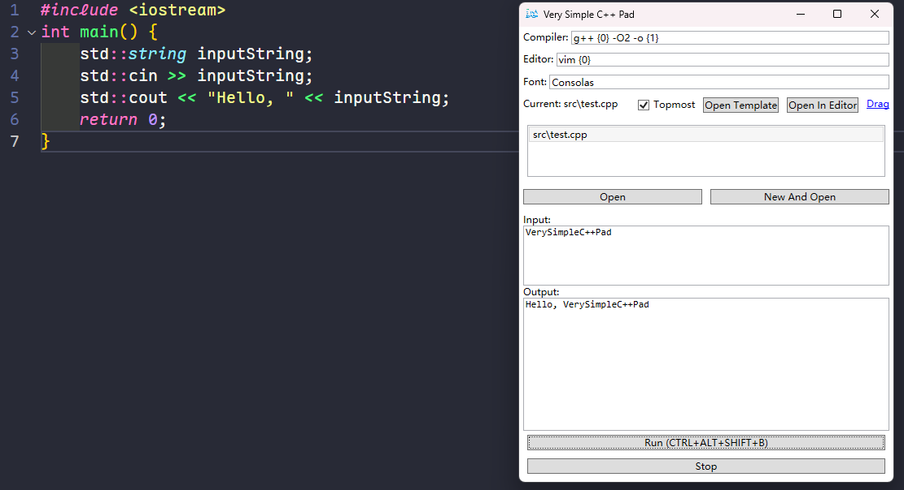

# Very Very Very Simple C++ Pad

Very Simple C++ Pad is a very simple C++ playground that allows you to quickly create and run C++ files.

It is extremely simple and does not support editing features; you can use other editors such as VSCode for editing.

